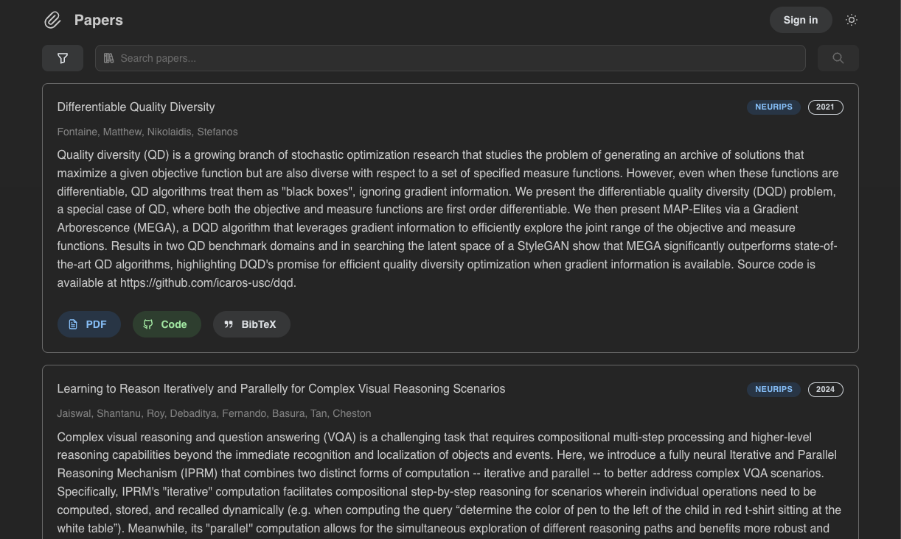

#

<div align="center">

[<h1>📎 Papers</h1>](https://papers.app/search/7546)

<i>Semantic search machine learning papers </i>

🌐 [**papers.app**](https://papers.app) | [**Follow on 𝕏**](https://x.com/mrremila)



</div>

## Supported conferences

- [x] NeurIPS
- [x] ICML
- [x] PMLR (AISTATS, COLT, CoRL,ICGI)
- [x] ICLR

## Features

- [x] Search papers using natural language queries
- [x] Save papers to collection
- [ ] Add list of citing papers to each paper (fostering reverse search)
- [ ] Display similar papers (ability to click on a paper and see other papers similar to it)
- [ ] Add citations count to papers
- [ ] Add upvotes count from huggingface if we can link the dbs
- [ ] Add heart button on homepage to papers (redirects to user login)

## Local Development

This will get a local instance of the app running, with sample data.

### Prerequisites

- Node.js
- npm
- Docker

### Steps

1. Clone and install

```bash
git clone git@github.com:marawangamal/Papers.git
cd git@github.com:marawangamal/Papers.git
npm install
npm run build
```

2. Install Supabase CLI

```bash
brew install supabase/tap/supabase  # macOS
```

3. Start local environment

```bash
docker start
supabase start
```

4. Set up environment

```bash
# Copy the displayed credentials into .env.local:
NEXT_PUBLIC_SUPABASE_URL=http://127.0.0.1:54321
NEXT_PUBLIC_SUPABASE_ANON_KEY=[your-local-anon-key]
```

5. Initialize database

```bash
supabase db reset
```

6. Start app

```bash
npm run dev
```

You should now see it on [http://localhost:3000](http://localhost:3000)

## Contributing

### Adding a new conference

To add a new conference, you must make a script that produces these two csvs:

- `venues.csv` (name, abbrev, year)
- `papers.csv` (title, authors, abstract, venue_abbrev, venue_year, pdf_url, code_url)

You can create the script from scratch or use the [ConferenceScraper](scripts/base.py) base class to help you. Here's a simple Example:

```python
from base import ConferenceScraper

class MyScraper(ConferenceScraper):
    # You just need to implement `get_venue` and `get_papers`
    def scrape_year(self, year: int):
        venue = get_venue(year) # Dict with keys:
        self.save_venue(venue)  # Saves the venue to `dumps/icml/venues.csv`
        for paper in get_papers(venue):
            self.save_paper(paper) # Saves the paper to `dumps/icml/papers.csv`

if __name__ == '__main__':
    scraper = MyScraper(output_dir='dumps/icml')
    scraper.scrape_year(2021)

```

Once the script is working on your machine, create a PR titled `Feat/add-conference-<year>-<abbreviation>` (e.g., `Feat/add-conference-2025-icml`). Once merged, one of the maintainers will run your script, then they will run `scripts/supabase_import.py --path path/to/dump` to import the data into the db server.

### Submitting a PR

1. Request access as a contributor
2. Create a new branch (`git checkout -b Feat/my-feature`) or (`git checkout -b Bugfix/remove-issue`)
3. Make your changes
4. Run linting: `npm run lint`
5. Commit your changes (`git commit -m 'Add some feature'`)
6. Open a Pull Request

## License

The code in this repository is licensed under the MIT license, unless otherwise specified in the header of the file.
